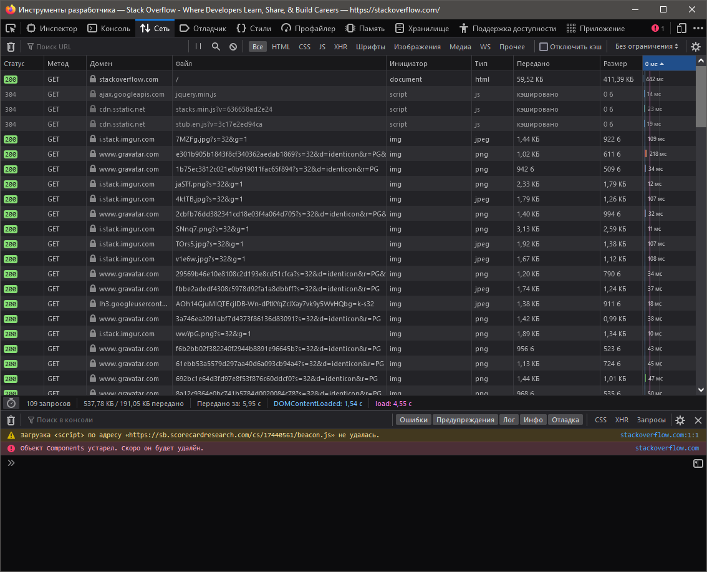

# Домашнее задание к занятию "3.6. Компьютерные сети, лекция 1"


1. Работа c HTTP через телнет.
- Подключитесь утилитой телнет к сайту stackoverflow.com
`telnet stackoverflow.com 80`
- отправьте HTTP запрос
- В ответе укажите полученный HTTP код, что он означает?
```bash
vagrant@vagrant:~$ telnet stackoverflow.com 80
Trying 151.101.193.69...
Connected to stackoverflow.com.
Escape character is '^]'.
GET /questions HTTP/1.0
HOST: stackoverflow.com

HTTP/1.1 301 Moved Permanently
cache-control: no-cache, no-store, must-revalidate
location: https://stackoverflow.com/questions
x-request-guid: 1469294c-1ca7-476c-b1df-42d69c0e9bbe
feature-policy: microphone 'none'; speaker 'none'
content-security-policy: upgrade-insecure-requests; frame-ancestors 'self' https://stackexchange.com
Accept-Ranges: bytes
Date: Wed, 09 Feb 2022 10:24:34 GMT
Via: 1.1 varnish
Connection: close
X-Served-By: cache-hel1410032-HEL
X-Cache: MISS
X-Cache-Hits: 0
X-Timer: S1644402274.139033,VS0,VE110
Vary: Fastly-SSL
X-DNS-Prefetch-Control: off
Set-Cookie: prov=ffbc18c8-e7c2-a06f-8e45-3a71acde47dc; domain=.stackoverflow.com; expires=Fri, 01-Jan-2055 00:00:00 GMT; path=/; HttpOnly

Connection closed by foreign host.
```
___
___
___

2. Повторите задание 1 в браузере, используя консоль разработчика F12.
- откройте вкладку `Network`
- отправьте запрос http://stackoverflow.com
- найдите первый ответ HTTP сервера, откройте вкладку `Headers`
- укажите в ответе полученный HTTP код.
- проверьте время загрузки страницы, какой запрос обрабатывался дольше всего?
- приложите скриншот консоли браузера в ответ.

```bash
HTTP/2 200 OK
cache-control: private
content-type: text/html; charset=utf-8
content-encoding: gzip
strict-transport-security: max-age=15552000
x-frame-options: SAMEORIGIN
x-request-guid: ef53bf6c-a24b-4fa0-a851-079159893a5a
feature-policy: microphone 'none'; speaker 'none'
content-security-policy: upgrade-insecure-requests; frame-ancestors 'self' https://stackexchange.com
accept-ranges: bytes
date: Wed, 09 Feb 2022 10:32:04 GMT
via: 1.1 varnish
x-served-by: cache-hel1410033-HEL
x-cache: MISS
x-cache-hits: 0
x-timer: S1644402724.981122,VS0,VE134
vary: Accept-Encoding,Fastly-SSL
x-dns-prefetch-control: off
X-Firefox-Spdy: h2
```


___
___
___
3. Какой IP адрес у вас в интернете?


___
___
___

4. Какому провайдеру принадлежит ваш IP адрес? Какой автономной системе AS? Воспользуйтесь утилитой `whois`


___
___
___

5. Через какие сети проходит пакет, отправленный с вашего компьютера на адрес 8.8.8.8? Через какие AS? Воспользуйтесь утилитой `traceroute`


___
___
___

6. Повторите задание 5 в утилите `mtr`. На каком участке наибольшая задержка - delay?


___
___
___

7. Какие DNS сервера отвечают за доменное имя dns.google? Какие A записи? воспользуйтесь утилитой `dig`


___
___
___

8. Проверьте PTR записи для IP адресов из задания 7. Какое доменное имя привязано к IP? воспользуйтесь утилитой `dig`


___
___
___
